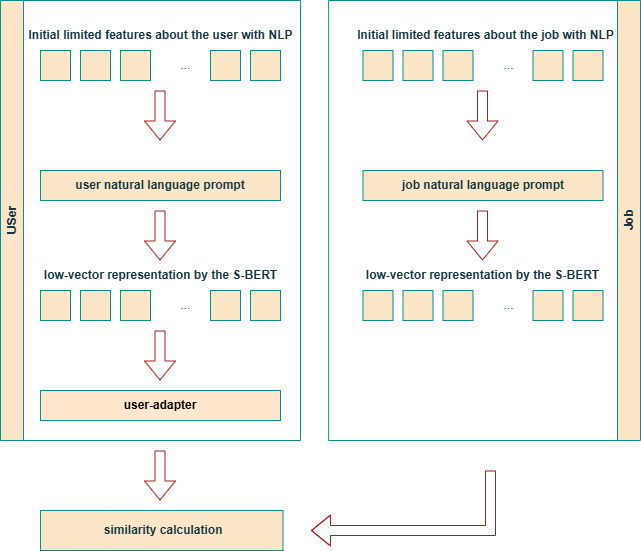

# Job Recommendation and the Role of Stereotypes

This project investigates how NLP-based job recommender systems reinforce bias.

The detailed documentation about the model is displayed in the paper attached to this repository.

## TL;DR



A Sentence-BERT (SBERT)-based Job Recommender System (JRS) designed to study bias via controlled injection of synthetic signals.

- A content-based job recommender using sentence embeddings ([JinaAI](https://huggingface.co/jinaai/jina-embeddings-v2-small-en))
- Inject controlled bias into user profiles
- Measure its effect on recommendations

## Key Finding

 - **Key point**: Small textual changes in user profiles can alter job recommendations and salary outcomes.

**Average Salary vs Bias**

NLP-based job recommender systems are prone to bias. For example, the pay gap between males and females is **~8\%**. 

Furthermore, adding a single sentence specifying a particular attribute to the model already affects the results. For example, when a "Political alignment" statement is present in the profile, irrespective of its value, the average recommended salary increases noticeably.

**Personality and readability vs Bias**

The observed correlation is relatively small. The jobs proposed to females are marginally more readable.

### Additional Findings

Beyond gender bias, the model shows sensitivity to:

- Political alignment: significant pay gap of **~12%**
- Age groups: highest salaries concentrated in the middle age group

See full results in `jrs_bias.pdf`.

## Model Overview

We implemented a  Content-based Filtering that takes into account the user’s profile (CBF-U) in this repository, while also observing the bias for the CBF-I (Content-based Filtering that takes into account the user’s interactions):

- User profiles are converted into text prompts
- Prompts are embedded using a Sentence-BERT-style model ([JinaAI](https://huggingface.co/jinaai/jina-embeddings-v2-small-en))
- Job descriptions are embedded using the same pipeline
- Recommendations are made via cosine similarity, optionally enhanced with a supervised UserAdapter model

## Datasets

**[CareerBuilder](https://www.kaggle.com/competitions/job-recommendation/data) (user-job interactions, used for the training)**

Provides ground-truth behavioral labels enabling the standard offline evaluation of ranking performance. The user table contains demographic and professional attributes.

**[LinkedIn Job Postings](https://www.kaggle.com/datasets/arshkon/linkedin-job-postings) (rich textual descriptions, used for the bias investigation)**

High-quality semantic descriptions of jobs containing textual fields (job title, description, requirements, and related metadata). Provides natural language content that can be transformed into dense embeddings for enhanced semantic matching.
  
## File Structure
```
└── cbf-u_model/
 ├── cbfu.ipynb                     # Step-by-step research walkthrough (experiments & exploration)
 ├── jobs_bias_investigation.pdf    # Paper describing the method
 ├── environment.yaml               # Conda environment file
 ├── README.md                      # Project overview and usage instructions
 ├── LICENSE                        # MIT License

 ├── data/                  # Dataset directory (download separately and place here)

 ├── images/                # Documentation images
 │   └── cbfu.png           # Pipeline diagram of the model    

 ├── train.py               # Model training and evaluation script
 ├── dataset.py             # Data loading and preprocessing utilities
 ├── bias_analysis.py       # Bias evaluation and experiments
 └── models.py              # Model definitions (embeddings + predictors)
```

## Download Data

Please download the datasets separately and paste them into the folder `data/`. The links to download data from *Kaggle* are below: [CareerBuilder](https://www.kaggle.com/competitions/job-recommendation/data) and [LinkedIn Job Postings](https://www.kaggle.com/datasets/arshkon/linkedin-job-postings).

## Run

As an initial setup, you need to set up an environment. To create the environment, paste the following lines in the command line opened to the code's base folder:

```
conda env create -f environment.yaml --solver=classic
conda activate cbf-u-model
```

See `cbfu.ipynb` for a full walkthrough of the pipeline and experiments. 

Run it only after all required data has been downloaded, and an environment has been set up.

## Project Information

### Contact

For questions, please open an issue or contact `r.chervinskyy@gmail.com`

### License

This project is licensed under the MIT License.